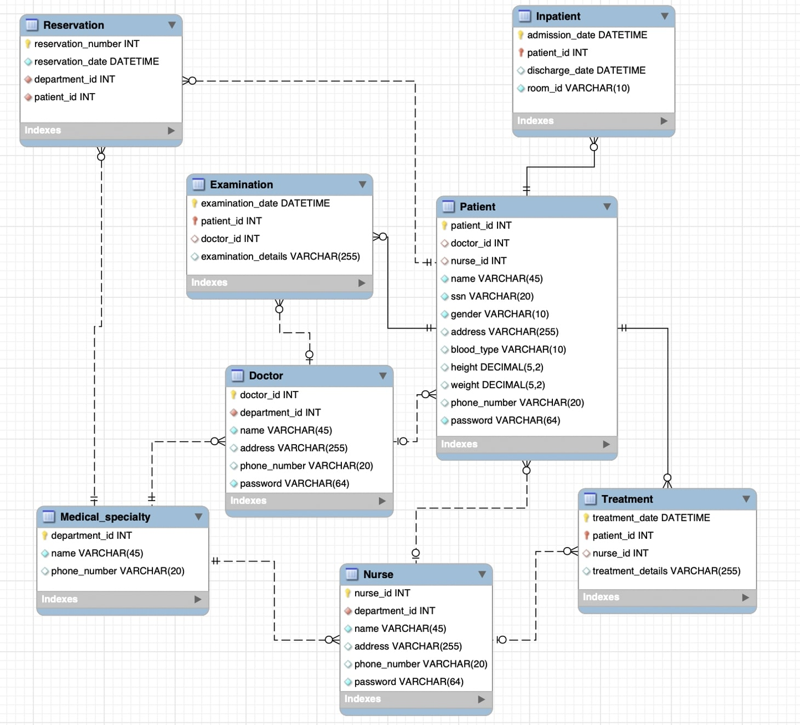

# 데이터베이스 Term-Project GIF 페이지
> 12191774 서강문
## 테이블
```
+--------------------+
| Tables_in_hospital |
+--------------------+
| Doctor             |
| Examination        |
| Inpatient          |
| Medical_specialty  |
| Nurse              |
| Patient            |
| Reservation        |
| Treatment          |
+--------------------+
```



## 기능

### 1. 관리자 페이지
<details>
<summary>이미지 접기/펼치기(25초)</summary>


</details>

### 2. 직원 페이지 : 의사
<details>
<summary>이미지 접기/펼치기(25초)</summary>


</details>

### 3. 직원 페이지 : 간호사
<details>
<summary>이미지 접기/펼치기(25초)</summary>


</details>

### 4. 직원 페이지 : 환자 조회
<details>
<summary>이미지 접기/펼치기(25초)</summary>


</details>

### 5. 환자 페이지
<details>
<summary>이미지 접기/펼치기(25초)</summary>


</details>

